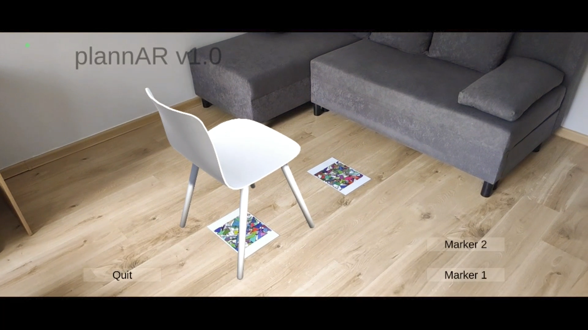

<!-- PROJECT LOGO -->
 

  

  <h3 align="center">plannAR - Interactive AR interior designer!</h3>

<!-- TABLE OF CONTENTS -->

  
Table of Contents

  <ol>
    <li>
      <a href="#about-the-project">About The Project</a>
      <ul>
        <li><a href="#built-with">Built With</a></li>
      </ul>
    </li>
    <li><a href="#usage">Usage</a></li>
    <li><a href="#license">License</a></li>
    <li><a href="#contact">Contact</a></li>
    <li><a href="#acknowledgments">Acknowledgments</a></li>
  </ol>

<!-- ABOUT THE PROJECT -->
## About The Project

plannAR is an interactive interior design tool developed with Unity and Vuforia extension. It is an app projecting 3D models on the special physical markers (graphics/markers). Demonstrative version contains 12 different models of furniture, but final product may be expanded with external database.

Project is a collaborative work done within students scientific association 'KNGK Geoinformatyka'. Undertaking was financed by 'Grant Rektora AGH 2022'.

(<a href="#readme-top">back to top</a>)

### Built With
List of programs with specific version used for this project:

* Unity 2020.3.30f1 (64-bit)
* Vuforia 10.5.5

(<a href="#readme-top">back to top</a>)

<!-- USAGE EXAMPLES -->
## Usage

Repository contains listed files:

* /app: Most up-to-date version of the application. Available only for Android devices.
* /graphics: Graphical materials including markers and images used in readme.
* project.zip: Complete Unity project. 

(<a href="#readme-top">back to top</a>)

<!-- LICENSE -->
## License

Distributed under the MIT License. See `LICENSE.txt` for more information.

(<a href="#readme-top">back to top</a>)

<!-- CONTACT -->
## Contact

Maciej Lipski - [@GitHub](https://github.com/maciejlipski) - maclipski1@gmail.com

Project Link: [https://github.com/maciejlipski/ar_designer](https://github.com/maciejlipski/ar_designer)

(<a href="#readme-top">back to top</a>)

<!-- ACKNOWLEDGMENTS -->
## Acknowledgments

This project would not be possible without the generous external support!

* [Grant Rektora AGH 2022](https://dss.agh.edu.pl/organizacje-studenckie/grant-rektora/edycja-2022)
* [KNGK Geoinformatyka](https://skn.agh.edu.pl/pl/kolo/kngk-geoinformatyka/)
* [Playful Technology Youtube Channel](https://www.youtube.com/@PlayfulTechnology)

(<a href="#readme-top">back to top</a>)

